Today we will resolve Devvortex.

Devvortex is a Linux machine with a level of dicultay easy.

In this machine, we will see some basic sub-domain enumaration in order to find hide hostnames, that will allow how to compromise a known CMS affected by a known CVE.

And I will show you how to take adavante of sudo permisions to escalate privileges.


## INTRO

* Name: Devvortex

* S.O: Linux

* IP address: 10.10.11.242

* Difficulty: Easy


## RECON

We will start with a TCP SYN-ACK (sS) scan on all the ports (-p-), sending requests  in mode Insane(T5) as we want to go very fast and the network is controlled, we want to avoid name resolution (-n) and host discovery (Pn) and we will save the output in nmap format (oN), but providing all the verbose information via the console (vvv).


```bash 
nmap -p- -sS --min-rate 5000 -T5 -n -Pn -vvv 10.10.11.242 -oN devvortex_recon.nmap  
Starting Nmap 7.92 ( https://nmap.org ) at 2024-01-19 15:23 CET
Initiating SYN Stealth Scan at 15:23
Scanning 10.10.11.242 [65535 ports]
Discovered open port 22/tcp on 10.10.11.242
Discovered open port 80/tcp on 10.10.11.242
Warning: 10.10.11.242 giving up on port because retransmission cap hit (2).
Completed SYN Stealth Scan at 15:24, 16.32s elapsed (65535 total ports)
Nmap scan report for 10.10.11.242
Host is up, received user-set (0.13s latency).
Scanned at 2024-01-19 15:23:48 CET for 16s
Not shown: 65533 closed tcp ports (reset)
PORT   STATE SERVICE REASON
22/tcp open  ssh     syn-ack ttl 63
80/tcp open  http    syn-ack ttl 63
```


We find 2 open ports 22 and 80


## ENUMERATION

**I will start with some basic enumerating (sCV) on 10.10.11.242 http and ssh services**


```bash 
└─# nmap -sCV -p22,80 -n -Pn -v 10.10.11.242 -oN devvortex_basic_enumeration  
Starting Nmap 7.92 ( https://nmap.org ) at 2024-01-19 16:12 CET
PORT   STATE SERVICE VERSION
22/tcp open  ssh     OpenSSH 8.2p1 Ubuntu 4ubuntu0.9 (Ubuntu Linux; protocol 2.0)
| ssh-hostkey: 
|   3072 48:ad:d5:b8:3a:9f:bc:be:f7:e8:20:1e:f6:bf:de:ae (RSA)
|   256 b7:89:6c:0b:20:ed:49:b2:c1:86:7c:29:92:74:1c:1f (ECDSA)
|_  256 18:cd:9d:08:a6:21:a8:b8:b6:f7:9f:8d:40:51:54:fb (ED25519)
80/tcp open  http    nginx 1.18.0 (Ubuntu)
|_http-title: Did not follow redirect to http://devvortex.htb/
| http-methods: 
|_  Supported Methods: GET HEAD POST OPTIONS
|_http-server-header: nginx/1.18.0 (Ubuntu)
Service Info: OS: Linux; CPE: cpe:/o:linux:linux_kernel
```

Under 80 port there is a nginx 1.18.0 running, the OS is ubuntu, and we also observe some redirection to devvortex.htb, so first action is to add this host to our /etc/hosts


**As usual, in order to get further information about frameworks, technologies, e-mails, users,..., We will start with Whatweb command**


```bash                                                                 
whatweb http://devvortex.htb/
http://devvortex.htb/ [200 OK] Bootstrap, Country[RESERVED][ZZ], Email[info@DevVortex.htb], HTML5, HTTPServer[Ubuntu Linux][nginx/1.18.0 (Ubuntu)], IP[10.10.11.242], JQuery[3.4.1], Script[text/javascript], Title[DevVortex], X-UA-Compatible[IE=edge], nginx[1.18.0]
```

We see some e-mail, let’s take note: **info@DevVortex.htb**,  who knows if we will need it in the future,  and apart from that, nothing else to highliht.

**Also we can have a look into the source page and look for some patterns, like password, .js, key, http or 10.10.**

```bash 
curl -v http://devvortex.htb | grep -iE 'http|.js|10.|pass|key' 
  % Total    % Received % Xferd  Average Speed   Time    Time     Time  Current
                                 Dload  Upload   Total   Spent    Left  Speed
  0     0    0     0    0     0      0      0 --:--:-- --:--:-- --:--:--     0*   Trying 10.10.11.242:80...
* Connected to devvortex.htb (10.10.11.242) port 80 (#0)
> GET / HTTP/1.1
> Host: devvortex.htb
> User-Agent: curl/7.81.0
> Accept: */*
> 
* Mark bundle as not supporting multiuse
< HTTP/1.1 200 OK
< Server: nginx/1.18.0 (Ubuntu)
< Date: Sat, 20 Jan 2024 10:48:09 GMT
< Content-Type: text/html
< Content-Length: 18048
< Last-Modified: Tue, 12 Sep 2023 17:45:54 GMT
< Connection: keep-alive
< ETag: "6500a3d2-4680"
< Accept-Ranges: bytes
< 
{ [2400 bytes data]
  <meta http-equiv="X-UA-Compatible" content="IE=edge" />
  <meta name="keywords" content="" />
  <link rel="stylesheet" type="text/css" href="https://cdnjs.cloudflare.com/ajax/libs/OwlCarousel2/2.3.4/assets/owl.carousel.min.css" />
  <link href="https://fonts.googleapis.com/css?family=Open+Sans:400,700|Poppins:400,700&display=swap" rel="stylesheet">
                        Unleash the power of the web with DevVortex - your compass in the digital realm
              We are DevVortex – a team of passionate developers, designers, and marketers dedicated to crafting exceptional online experiences. Our journey begins with HTML5 and CSS, the building blocks of captivating websites that engage and inspire. But our identity goes deeper than code; we're driven by a relentless pursuit of innovation. Through strategic marketing prowess, we elevate your brand's digital presence, ensuring it resonates with your target audience. DevVortex isn't just an agency; we're a collaborative force, ready to bring your unique digital aspirations to life.
100 18048  100 18048    0     0  41514      0 --:--:-- --:--:-- --:--:-- 41585
      <a href="https://html.design/">DevVortex</a>
  <script type="text/javascript" src="js/jquery-3.4.1.min.js"></script>
  <script type="text/javascript" src="js/bootstrap.js"></script>
  <script type="text/javascript" src="https://cdnjs.cloudflare.com/ajax/libs/OwlCarousel2/2.3.4/owl.carousel.min.js">
        1000: {
```

We don't see anything intesting.

**So, let's have a look into webpage**

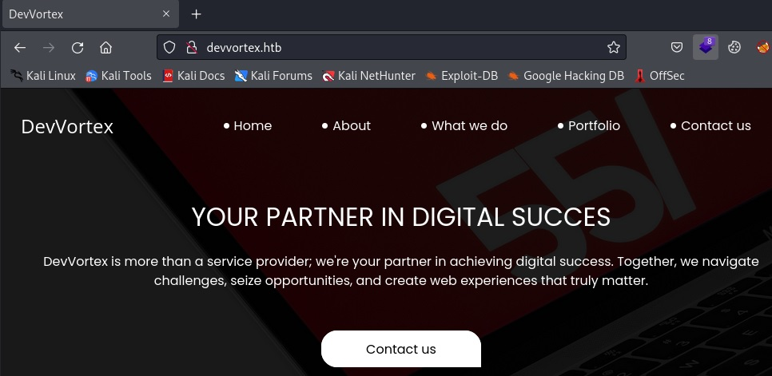

Finally after some basic enumeration, we don't see any clear path to compromise the machine, so we will keep enumerating.

**Next step is to find out directories or subdomains under devvortex.htb**

We will start with directory enumeration under http://devvortex.htb


For directory discovery, we can use different tools, I will use a fuzzing tool called wfuzz

**What is wfuzz**

 Wfuzz is a web fuzzer and its concept is very simple. It replaces any reference to the FUZZ keyword by the value of a given payload.

Further information:  [https://github.com/xmendez/wfuzz](https://github.com/xmendez/wfuzz){:target="_blank"}

We will apply fuzzing to http://devvortex.htb replainc FUZZ for every line found in the raft-medium-words.txt dictionary, we will see the output with colors (c), but we don't want to see 404 not found in the output (hc), and to go faster, we will use 50 threads (t).

```bash
wfuzz -c --hc=404 -t 50 -w /usr/share/seclists/Discovery/Web-Content/raft-medium-words.txt http://devvortex.htb/FUZZ
 /usr/lib/python3/dist-packages/wfuzz/__init__.py:34: UserWarning:Pycurl is not compiled against Openssl. Wfuzz might not work correctly when fuzzing SSL sites. Check Wfuzz's documentation for more information.
********************************************************
* Wfuzz 3.1.0 - The Web Fuzzer                         *
********************************************************

Target: http://devvortex.htb/FUZZ
Total requests: 63088

=====================================================================
ID           Response   Lines    Word       Chars       Payload                                                   
=====================================================================

000000003:   301        7 L      12 W       178 Ch      "images"                                                  
000000015:   301        7 L      12 W       178 Ch      "js"                                                      
000000021:   301        7 L      12 W       178 Ch      "css"                                                     
000000400:   200        583 L    1274 W     18048 Ch    "."  
```

We don’t find any interesting directory under devvortex.htb, so next step is try to find sub-domains

Same concept, we will use wfuzz to find subdomains, in this case we can use a specific subdomain dictionary.

```bash
wfuzz -c -t 50 -u http://10.10.11.242 -H "Host: FUZZ.devvortex.htb" -w /usr/share/seclists/Discovery/DNS/subdomains-top1million-20000.txt 
* Wfuzz 3.1.0 - The Web Fuzzer                         *
********************************************************

Target: http://10.10.11.242/
Total requests: 19966

=====================================================================
ID           Response   Lines    Word       Chars       Payload                                                   
=====================================================================

000000034:   302        7 L      10 W       154 Ch      "support"                                                 
000000015:   302        7 L      10 W       154 Ch      "ns"                                                      
000000031:   302        7 L      10 W       154 Ch      "mobile"                                                  
000000038:   302        7 L      10 W       154 Ch      "demo"                                                    
000000037:   302        7 L      10 W       154 Ch      "shop"                                                    
000000007:   302        7 L      10 W       154 Ch      "webdisk"                                                 
000000001:   302        7 L      10 W       154 Ch      "www"                                                     
000000036:   302        7 L      10 W       154 Ch      "secure"                                                  
000000003:   302        7 L      10 W       154 Ch      "ftp"                                                     
000000035:   302        7 L      10 W       154 Ch      "cp"                                                      
000000033:   302        7 L      10 W       154 Ch      "beta"                                                    
000000027:   302        7 L      10 W       154 Ch      "mx"       
```

We are getting a lot of 302 responses, basically because the host.devvortex.htb does not exist and the side redirects us to the home page, so to avoid all that noise, we can hide for example the output with the same number of characters (--hh=154).


```bash
wfuzz -c --hc=404 --hh=154 -t 50 -w /usr/share/seclists/Discovery/DNS/subdomains-top1million-20000.txt -u http://10.10.11.242 -H "Host: FUZZ.devvortex.htb" 
********************************************************
* Wfuzz 3.1.0 - The Web Fuzzer                         *
********************************************************

Target: http://10.10.11.242/
Total requests: 19966

=====================================================================
ID           Response   Lines    Word       Chars       Payload                                                   
=====================================================================

000000019:   200        501 L    1581 W     23221 Ch    "dev"      
```


Ok, the machine is applying virtual hosting and as we can see is hosting other sites under different sub-domains.

**Next step would be start againg with some basic enumeration but now on http://dev.devvortex.htb**

But first, we need to add the new host to our /etc/hosts, so we can resolv it.

We will move forward, running **whatweb and curl**, to get more info about the new site.
```bash
whatweb http://dev.devvortex.htb
http://dev.devvortex.htb [200 OK] Bootstrap, Cookies[1daf6e3366587cf9ab315f8ef3b5ed78], Country[RESERVED][ZZ], Email[contact@devvortex.htb,contact@example.com,info@Devvortex.htb,info@devvortex.htb], HTML5, HTTPServer[Ubuntu Linux][nginx/1.18.0 (Ubuntu)], HttpOnly[1daf6e3366587cf9ab315f8ef3b5ed78], IP[10.10.11.242], Lightbox, Script, Title[Devvortex], UncommonHeaders[referrer-policy,cross-origin-opener-policy], X-Frame-Options[SAMEORIGIN], nginx[1.18.0]
```

And curl to get the source code and filter by some interesing patterns

```bash
curl -v http://dev.devvortex.htb | grep -iE "http|pass|key|10.|.php|.js"
  % Total    % Received % Xferd  Average Speed   Time    Time     Time  Current
                                 Dload  Upload   Total   Spent    Left  Speed
  0     0    0     0    0     0      0      0 --:--:-- --:--:-- --:--:--     0*   Trying 10.10.11.242:80...
* Connected to dev.devvortex.htb (10.10.11.242) port 80 (#0)
> GET / HTTP/1.1
> Host: dev.devvortex.htb
> User-Agent: curl/7.81.0
> Accept: */*
> 
* Mark bundle as not supporting multiuse
< HTTP/1.1 200 OK
< Server: nginx/1.18.0 (Ubuntu)
< Date: Sat, 20 Jan 2024 11:24:55 GMT
< Content-Type: text/html; charset=utf-8
< Transfer-Encoding: chunked
< Connection: keep-alive
< Set-Cookie: 1daf6e3366587cf9ab315f8ef3b5ed78=8fcnlgo9jj4h018t8394v5f2ep; path=/; HttpOnly
< x-frame-options: SAMEORIGIN
< referrer-policy: strict-origin-when-cross-origin
< cross-origin-opener-policy: same-origin
< Expires: Wed, 17 Aug 2005 00:00:00 GMT
< Last-Modified: Sat, 20 Jan 2024 11:24:55 GMT
< Cache-Control: no-store, no-cache, must-revalidate, post-check=0, pre-check=0
< Pragma: no-cache
< 
{ [752 bytes data]
  <meta content="" name="keywords">
  <link href="https://fonts.googleapis.com/css?family=Open+Sans:300,300i,400,400i,600,600i,700,700i|Raleway:300,300i,400,400i,500,500i,600,600i,700,700i|Poppins:300,300i,400,400i,500,500i,600,600i,700,700i" rel="stylesheet">
              <p>A108 Adam Street, New York, NY 535022</p>
                A108 Adam Street <br>
100 23221    0 23221    0     0  50445      0 --:--:-- --:--:-- --:--:-- 50480
* Connection #0 to host dev.devvortex.htb left intact
  <!-- Vendor JS Files -->
  <script src="/media/templates/site/cassiopeia/assets/vendor/aos/aos.js"></script>
  <script src="/media/templates/site/cassiopeia/assets/vendor/bootstrap/js/bootstrap.bundle.min.js"></script>
  <script src="/media/templates/site/cassiopeia/assets/vendor/glightbox/js/glightbox.min.js"></script>
  <script src="/media/templates/site/cassiopeia/assets/vendor/isotope-layout/isotope.pkgd.min.js"></script>
  <script src="/media/templates/site/cassiopeia/assets/vendor/swiper/swiper-bundle.min.js"></script>
  <script src="/media/templates/site/cassiopeia/assets/vendor/php-email-form/validate.js"></script>
  <!-- Template Main JS File -->
  <script src="/media/templates/site/cassiopeia/assets/js/main.js"></script>
                                                                             
```
Notice the /media/templates/site/cassiopeia directory, it sounds like a content management system (CMS)

We can double check looking for it on Internet.

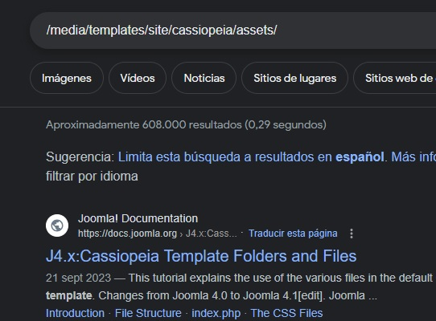

**It seems the dev.devvortex.htb site is serving a Joomla CMS.**

**What is Joomla**

Joomla! is a free and open-source content management system (CMS) for publishing web content.

And if the Joomla's version is not up to date, that could lead me to some RCE trough some known CVE.

Let's try it.

First step is to check Joomla's version

**we can find the version in joomla.xml file**


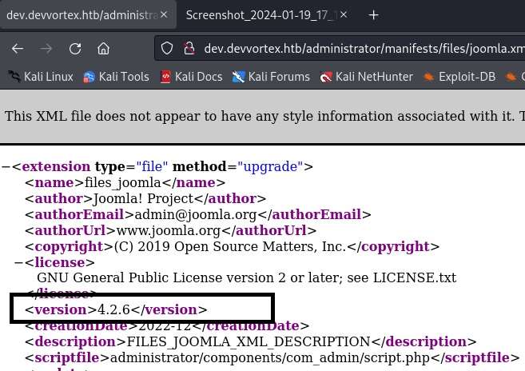


So it is running Joomla 4.2.6


**We have a look for known vulnerabilities** affecting Joomla 4.2.6 and we find an interesting one, **improper access check affecting Joomla! 4.0.0 through 4.2.7**:


 [https://nvd.nist.gov/vuln/detail/CVE-2023-23752](https://nvd.nist.gov/vuln/detail/CVE-2023-23752){:target="_blank"}

 **Joomla security advisory:**
 [https://developer.joomla.org/security-centre/894-20230201-core-improper-access-check-in-webservice-endpoints.html](https://developer.joomla.org/security-centre/894-20230201-core-improper-access-check-in-webservice-endpoints.html){:target="_blank"}

## EXPLOITATION

**CVE-2023-23752**

Due to flaws in Joomla’s access control to Web service endpoints, unauthenticated attackers can access the RestAPI interface to obtain Joomla-related configuration information by constructing specially crafted requests, which eventually leads to the disclosure of sensitive information

More information
[https://nsfocusglobal.com/joomla-unauthorized-access-vulnerability-cve-2023-23752-notice/](https://nsfocusglobal.com/joomla-unauthorized-access-vulnerability-cve-2023-23752-notice/){:target="_blank"}


If we look for some exploits on internet related to this CVE we can find some of them.

Let's analyse this one:
 [https://github.com/Acceis/exploit-CVE-2023-23752/blob/master/exploit.rb](https://github.com/Acceis/exploit-CVE-2023-23752/blob/master/exploit.rb){:target="_blank"}


We observe the exploit abuses of the authentication bypass issue to leak the system's configuration, which contains the Joomla! MySQL database credentials in plaintext

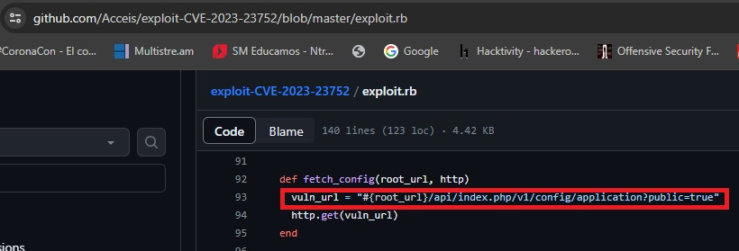

or the Joomla's user database

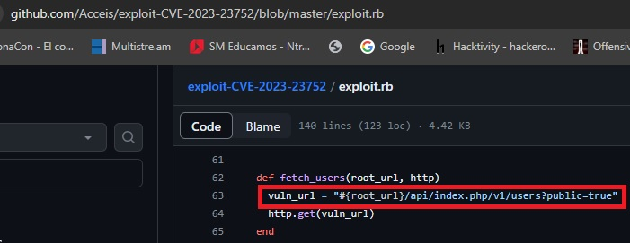

**So, my approach will be**

Try to get some credentails abusing of the known CVE, that would allow me to either log in the system via ssh or access the CMS as administrator, in order to get a RCE by uploading some reverse shell, e.g

**So step by step, we will start trying to get the MySQL credentials**

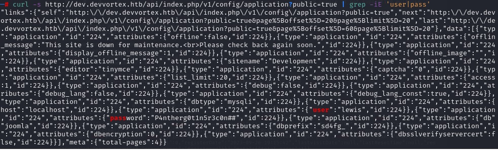


**We can also leak the mysql Joomla user database**

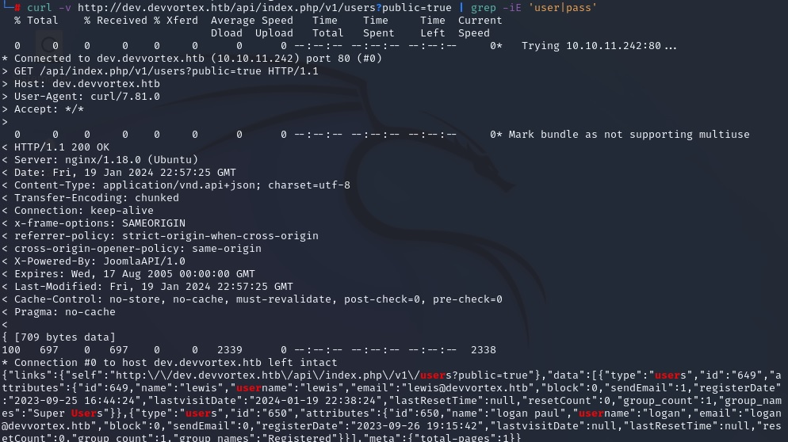


**So we get some MySQL DB credentials and another user:**

```bash
lewis / password:P4ntherg0t1n5r3c0n##

and logan user
```

We try to connect via ssh, but the credentials did not work.

Then we can try to log in Joomla admin site  using those credentials
(lewis / P4ntherg0t1n5r3c0n## )


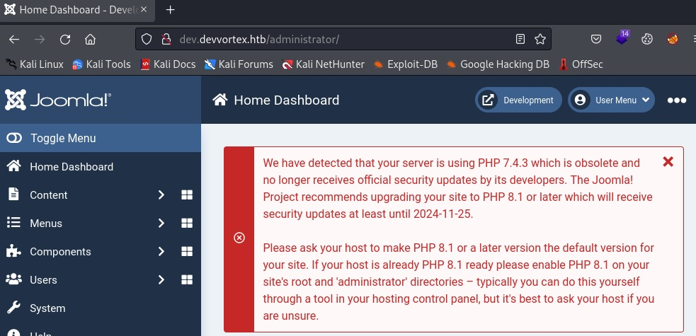

**!!!!It worked!!!!**

So, once we have access as administrator, we can use different ways to get a RCE, one of them is just to include some php code in a template. 

For example we can include a reverse php shell that connect back to my local machine.

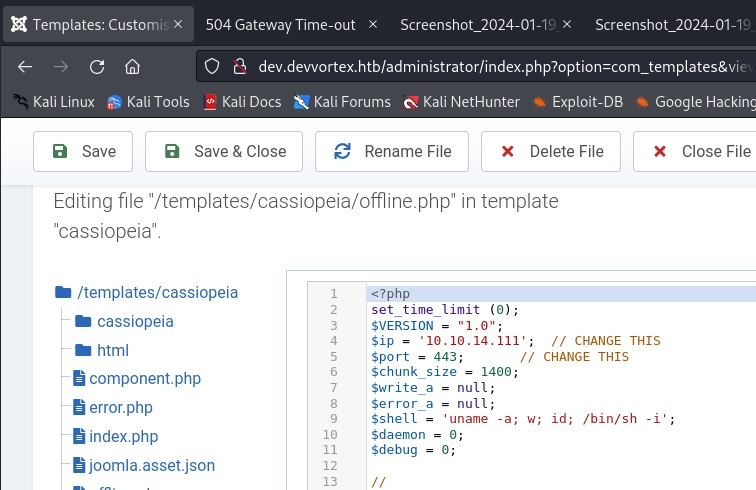


Next step is just run the listener on my local computer and access to the template

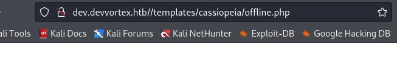


**And there it is:**


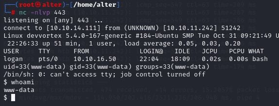


But we cannot get the flag, as the flag's owner is logan user, and  the reverse shell we got is owned by www-data (web server running Joomla is under those permissions)

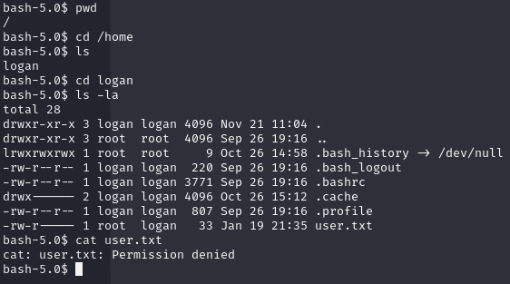


So we need to escalate privileges to logan user.


## PRIV ESCALATION TO LOGAN

We have mysql credentials, and we now logan is a user of the CMS, so my plan now is to connect to MySQL DB as administrator (lewis/password) , and collect logan hash to try to crack it.


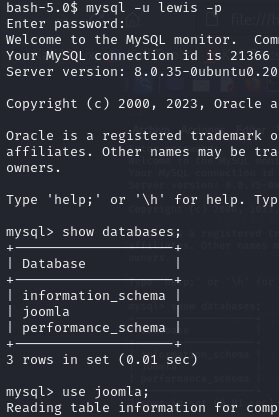

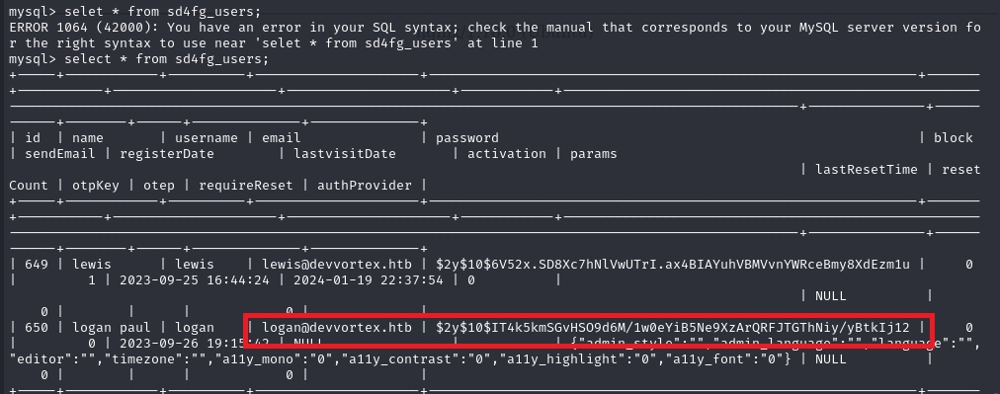

**We get the hash of logan user:**
"$2y$10$IT4k5kmSGvHSO9d6M/1w0eYiB5Ne9XzArQRFJTGThNiy/yBtkIj12"

"$$2a\$"

 is a good  indicator of a  bcrypt format, so let’s see if logan user has a weak password and then we are able to crack it.

I will use john and rockyou.txt as dictionary

```bash 
john -format=bcrypt --wordlist=/usr/share/wordlists/rockyou.txt mysql_credentials.txt
Using default input encoding: UTF-8
Loaded 1 password hash (bcrypt [Blowfish 32/64 X3])
Cost 1 (iteration count) is 1024 for all loaded hashes
Press 'q' or Ctrl-C to abort, almost any other key for status
tequieromucho    (?)     
1g 0:00:00:41 DONE (2024-01-19 23:43) 0.02396g/s 33.65p/s 33.65c/s 33.65C/s leelee..harry
Use the "--show" option to display all of the cracked passwords reliably
Session completed.

```

```bash
Logan's password is: tequieromucho
```


**let’s log in devvortex**

```bash
ssh -l logan htb   
logan@htb's password: 

Last login: Fri Jan 19 23:05:18 2024 from 10.10.14.243
-bash-5.0$ whoami
logan
```

## PRIV ESCALATION FROM LOGAN TO ROOT


As usual, I will start with some basic enumeration command like sudo -l

 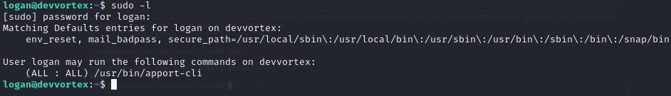


And we can see that logan user is able to run /usr/bin/apport-cli as root, so let’s research on this command, because it could lead to achieve a root shell


**What is apport-cli**

apport automatically collects data from crashed processes and compiles a problem report in /var/crash/. This is a command line frontend for reporting those crashes to the developers

On internet we found that apport-cli could allow to priv escalation.

Further information: 
 [ https://cve.mitre.org/cgi-bin/cvename.cgi?name=CVE-2023-1326]( https://cve.mitre.org/cgi-bin/cvename.cgi?name=CVE-2023-1326){:target="_blank"}


 **CVE-2023-1326**

 The apport-cli supports view a crash. These features invoke the default pager, which is likely to be less, other functions may apply.

It can be used to break out from restricted environments by spawning an interactive system shell. If the binary is allowed to run as superuser by sudo, it does not drop the elevated privileges and may be used to access the file system, escalate or maintain privileged access.

 [https://bugs.launchpad.net/ubuntu/+source/apport/+bug/2016023](https://bugs.launchpad.net/ubuntu/+source/apport/+bug/2016023){:target="_blank"}


**Let's then first to generate a crash file, as we need to read it using apport-cli**

We follow this documentation:


 [https://stackoverflow.com/questions/6152232/how-to-generate-core-dump-file-in-ubuntu](https://stackoverflow.com/questions/6152232/how-to-generate-core-dump-file-in-ubuntu){:target="_blank"}

 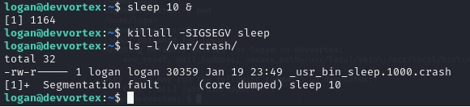

 Now we are going to read the crash file and  break out by spawning an interactive system shell with !/bin/bash.


 **If it works, we will get a shell as root**

 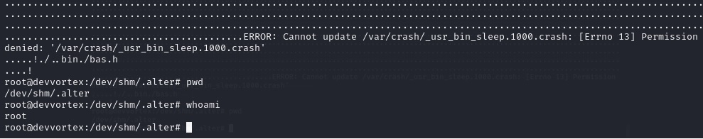
